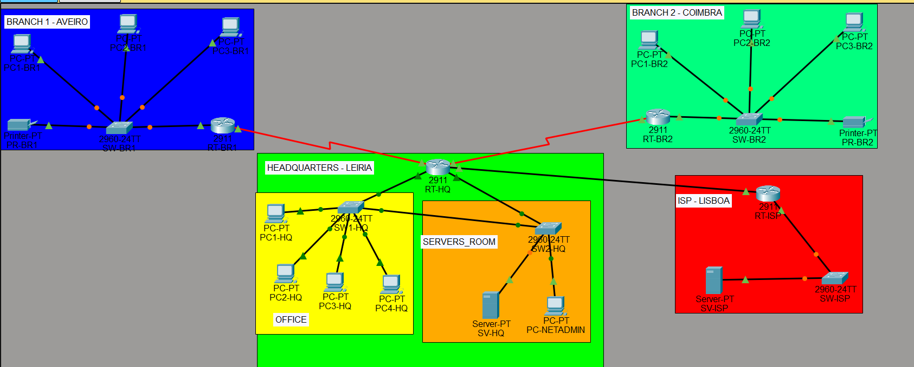

# Enterprise WAN, OSPF, NAT and Security — Cisco Packet Tracer

<p align="center">
  
  
  
  
  
  
  
  
  
  
  
</p>

## Overview

This project is a complete Cisco Packet Tracer lab designed to simulate a small enterprise network with a central headquarters, two remote branches, an ISP connection, internal services, management access, and a public-facing network.

The main purpose of the project is to demonstrate the ability to **design, configure, validate, secure, troubleshoot, and document an enterprise-style network** using technologies and practices commonly studied in the Cisco CCNA Enterprise Networking, Security, and Automation (ENSA) curriculum.

The repository was organized not only as a Packet Tracer exercise, but also as a **technical portfolio project**. For that reason, the project includes configuration evidence, connectivity tests, troubleshooting scenarios, addressing documentation, security validation, and screenshots that make the implementation easier to understand and review.

This README provides a high-level view of the project. The detailed explanations, commands, validation steps, screenshots, and technical notes are kept inside the corresponding folders of the repository.

---

## What does this project represent?

In simple terms, the network represents a company with:

- one **Headquarters (HQ)**;
- two **Branch Offices**;
- several separate internal network areas;
- an internal server;
- a management workstation;
- an ISP connection;
- a simulated public network;
- communication between all company locations;
- controlled access to management resources;
- centralized network services;
- monitoring and administration features.

The objective was to make the network behave like a small enterprise environment instead of building a set of isolated Packet Tracer exercises.

A user connected at a branch office should be able to communicate with the required internal company resources, while the routers dynamically exchange routing information and the headquarters controls access between the internal network and the simulated external network.

---

## Project Goals

The project was created with the following goals:

- Design a structured enterprise network topology.
- Connect a headquarters site with two remote branch offices.
- Separate network traffic according to its role.
- Provide communication between different internal network segments.
- Automatically distribute network information between routers.
- Provide centralized IP configuration for client devices.
- Allow internal devices to communicate with a simulated external network.
- Restrict access to management resources.
- Configure remote administration of network devices.
- Introduce monitoring and management services.
- Implement IPv6 alongside the IPv4 network.
- Validate the implementation through end-to-end connectivity tests.
- Create deliberate network failures and troubleshoot them systematically.
- Document the project in a format suitable for a technical portfolio.

---

## High-Level Network Scenario

The topology is divided into four main areas.

<p align="center">
  
</p>

<p align="center">
  <em>Complete enterprise topology implemented in Cisco Packet Tracer.</em>
</p>

### Headquarters

The headquarters contains the main routing device, two switches, user devices, internal services, and the network management workstation.

Different types of traffic are logically separated so that users, servers, and management devices do not all share the same network segment.

The headquarters is also the central point through which the company reaches the simulated ISP network.

### Branch Office 1

Branch 1 represents a remote company location connected to the headquarters through a WAN link.

Users in this branch receive their network configuration automatically and can reach resources hosted at the headquarters.

### Branch Office 2

Branch 2 follows the same general design as Branch 1 and provides a second remote site for testing routing, centralized services, and inter-branch communication.

### ISP / Public Network

A separate router represents the Internet Service Provider.

Behind it, a simulated public network is used to test communication between the enterprise environment and an external destination without requiring real Internet access.

---

## What This Project Demonstrates

From a recruitment perspective, this repository is intended to show more than the ability to enter Cisco IOS commands.

It demonstrates experience with the complete lifecycle of a networking lab:

**planning → implementation → verification → troubleshooting → documentation**

The project required working with:

- enterprise network topology design;
- IPv4 addressing planning;
- IPv6 addressing planning;
- router and switch configuration;
- LAN segmentation;
- WAN connectivity;
- dynamic routing;
- default routing;
- centralized client addressing;
- address translation;
- access control;
- secure remote administration;
- network monitoring and management;
- connectivity validation;
- fault isolation;
- troubleshooting methodology;
- technical documentation;
- evidence collection for reproducible results.

The detailed implementation of each area is documented separately in this repository so that each topic can be reviewed independently.

---

## Repository Structure

```text
.
├── addressing/
├── configs/
├── connectivity/
├── dhcp/
├── ipv6/
├── management/
├── nat/
├── routing/
├── security/
├── topology/
├── troubleshooting/
├── vlan-trunks/
├── .gitattributes
├── project.pkt
└── README.md
```

Each folder focuses on a specific part of the implementation.

### `addressing/`

Contains the IPv4 and IPv6 addressing information used throughout the topology.

This folder provides the reference needed to understand which networks, interfaces, gateways, and devices are used in the project.

### `configs/`

Contains configuration material related to the network devices.

It provides a centralized location for reviewing the configurations used in the final implementation.

### `connectivity/`

Contains evidence of communication between important parts of the network.

The screenshots and tests in this folder are used to demonstrate that traffic can successfully move between headquarters, branch offices, internal servers, and the simulated public network.

### `dhcp/`

Contains documentation and evidence related to the automatic assignment of network configuration to client devices.

### `ipv6/`

Contains the IPv6 implementation and validation evidence.

IPv6 was implemented alongside the main IPv4 network to extend the project beyond an IPv4-only environment.

### `management/`

Contains evidence related to the administration and monitoring of the network infrastructure.

This includes the mechanisms used to remotely manage devices and collect operational information from the network.

### `nat/`

Contains the implementation and validation evidence for communication between private enterprise networks and the simulated external network.

### `routing/`

Contains routing-related evidence and validation.

This folder documents how the routers learn about remote networks and how the different company locations become reachable from one another.

### `security/`

Contains the controls used to protect management access and restrict unwanted traffic.

It also includes evidence showing which devices are authorized to perform administrative actions.

### `topology/`

Contains visual documentation of the complete Packet Tracer network.

This is the best starting point for understanding how the headquarters, branches, ISP, switches, routers, servers, and client devices are connected.

### `troubleshooting/`

Contains deliberately introduced network failures and the steps used to identify and correct them.

Each troubleshooting scenario follows the same general process:

```text
Working network
      ↓
Fault introduced
      ↓
Symptoms observed
      ↓
Diagnosis
      ↓
Configuration corrected
      ↓
Network verified again
```

This folder is particularly important because it demonstrates not only configuration knowledge, but also the ability to investigate network problems systematically.

### `vlan-trunks/`

Contains evidence related to the logical separation of the headquarters network and the switch links that transport traffic between network devices.

### `project.pkt`

The complete Cisco Packet Tracer project file.

Opening this file provides access to the full topology and device configurations.

---

## How to Explore the Project

If you are not familiar with networking, the easiest way to review the repository is:

1. Start with the `topology/` folder to see the complete network.
2. Review `addressing/` to understand how the devices are organized.
3. Open `connectivity/` to see evidence that the network works.
4. Review `security/` to see how administrative access is protected.
5. Review `troubleshooting/` to see examples of failures being diagnosed and resolved.

If you are reviewing the project from a networking or infrastructure perspective, the folders can be inspected independently depending on the topic of interest.

For example:

```text
Routing          → routing/
LAN segmentation → vlan-trunks/
Addressing       → addressing/
DHCP             → dhcp/
NAT              → nat/
Security         → security/
IPv6             → ipv6/
Management       → management/
Validation       → connectivity/
Troubleshooting  → troubleshooting/
```

---

## Validation Approach

The project was not considered complete simply because the device configurations were entered successfully.

The network was validated using multiple types of evidence, including:

- device interface status;
- routing information;
- routing neighbor relationships;
- VLAN and trunk information;
- dynamically assigned client addresses;
- internal connectivity tests;
- inter-branch connectivity tests;
- access to internal services;
- communication with the simulated public network;
- security tests;
- remote management tests;
- IPv6 connectivity;
- troubleshooting before-and-after comparisons.

This approach makes it possible to verify the behaviour of the network instead of relying only on configuration files.

---

## Troubleshooting Component

A dedicated part of the project focuses on troubleshooting.

Several faults are deliberately introduced into an otherwise functional network. The resulting symptoms are then investigated using Cisco IOS verification commands and connectivity tests.

The purpose is to demonstrate a structured troubleshooting process rather than simply applying a known fix.

The documented incidents include routing-related failures, configuration mistakes, and traffic-control problems.

Detailed explanations and evidence are available in the `troubleshooting/` folder.

---

## Skills Demonstrated

This project provides practical evidence of experience with:

- Cisco Packet Tracer;
- Cisco IOS CLI;
- enterprise LAN and WAN design;
- router and switch configuration;
- IPv4 and IPv6;
- dynamic routing;
- network segmentation;
- centralized network services;
- traffic filtering;
- network address translation;
- secure device administration;
- network monitoring;
- connectivity testing;
- troubleshooting and root-cause analysis;
- technical documentation;
- Git/GitHub project organization.

The project was designed as a practical extension of CCNA-level networking knowledge, with emphasis on combining multiple technologies in the same environment rather than testing each one in isolation.

---

## Technologies and Tools

| Technology / Tool | Role in the Project |
|---|---|
| Cisco Packet Tracer | Network simulation environment |
| Cisco IOS | Router and switch configuration |
| IPv4 | Main addressing and connectivity |
| IPv6 | Dual-stack networking extension |
| OSPF | Dynamic communication of routing information |
| VLANs | Logical separation of LAN traffic |
| 802.1Q Trunking | Transport of multiple VLANs between network devices |
| DHCP | Automatic client network configuration |
| NAT/PAT | Translation between internal and external networks |
| ACLs | Traffic and management access control |
| SSH | Secure remote device administration |
| NTP | Time synchronization |
| Syslog | Centralized event logging |
| SNMP | Network monitoring |
| Git / GitHub | Documentation and version control |

The implementation details for these technologies are intentionally kept in their respective folders so that this README remains an accessible overview of the complete project.

---

## Intended Audience

This repository was designed to be understandable by different audiences.

For a **networking recruiter or engineer**, it provides configuration evidence, verification outputs, troubleshooting scenarios, and a complete Packet Tracer topology.

For a **technical recruiter without a networking specialization**, it shows the ability to build and document a multi-site infrastructure project, validate its behaviour, identify faults, and organize technical evidence.

For someone with **no networking background**, the project can be understood as a simulation of how multiple company locations communicate securely and share centralized network services.

---

## Project File

To inspect the full implementation, open:

```text
project.pkt
```

with Cisco Packet Tracer.

The repository screenshots and documentation can still be reviewed without Packet Tracer, but the `.pkt` file provides access to the complete interactive network.

---

## Project Status

The network implementation includes the main IPv4 enterprise topology, headquarters and branch connectivity, centralized services, security controls, management features, troubleshooting scenarios, and an IPv6 extension.

The repository is structured so that each technical area can be documented and expanded independently.

---

## Why This Project Is in My Portfolio

The goal of this project is to demonstrate the transition from learning networking concepts individually to applying them together in a complete environment.

Rather than configuring a single router, switch, or protocol in isolation, the project required multiple components to operate as one network.

This includes planning the topology, assigning addresses, configuring network devices, providing services, securing administrative access, validating communication, investigating failures, and documenting the final result.

For that reason, the repository is intended to serve both as a learning record and as practical evidence of networking skills.

---

## Author

**José Branco**

Computer Engineering student with an interest in networking, cloud infrastructure, cybersecurity, and systems administration.

---

> **Note:** This project was developed in a simulated environment using Cisco Packet Tracer. The addressing used for external/public examples is documentation-oriented and does not represent production Internet infrastructure.
