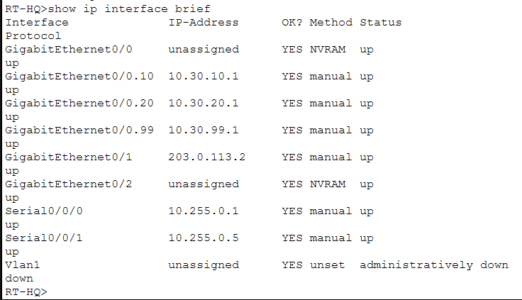
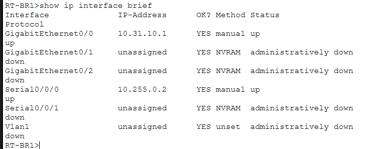
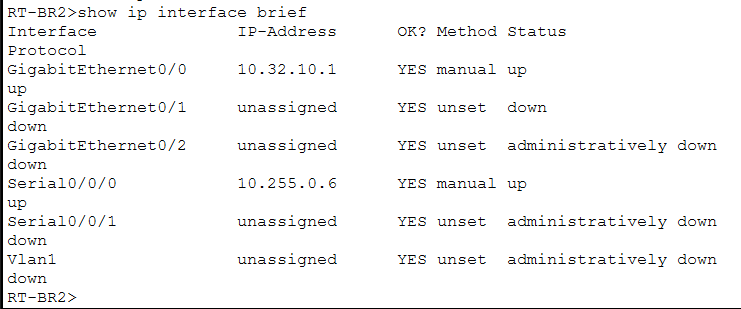

# Addressing Plan

## Purpose

This folder documents the IPv4 addressing implemented on the main routers of the enterprise topology.

The addressing plan was designed so that each location and network role can be identified easily. Headquarters, Branch 1, Branch 2, WAN links, management networks, and simulated external networks all use separate address ranges.

---

## IPv4 Structure

| Area | Network |
|---|---|
| HQ Users | `10.30.10.0/24` |
| HQ Servers | `10.30.20.0/24` |
| HQ Management | `10.30.99.0/24` |
| Branch 1 | `10.31.10.0/24` |
| Branch 2 | `10.32.10.0/24` |
| HQ ↔ Branch 1 | `10.255.0.0/30` |
| HQ ↔ Branch 2 | `10.255.0.4/30` |
| HQ ↔ ISP | `203.0.113.0/30` |
| Simulated Public Network | `198.51.100.0/24` |

The screenshots below show the addressing applied to the main routing devices.

---

## RT-HQ Interfaces

  

  <em>IPv4 interface configuration and operational status on the headquarters router.</em>

`RT-HQ` is the central routing device. It provides gateways for the headquarters VLANs, connects to both branches, and provides the path toward the simulated ISP.

---

## RT-BR1 Interfaces

  

  <em>IPv4 interface configuration and operational status on the Branch 1 router.</em>

Branch 1 uses its local LAN interface as the default gateway for branch clients and a point-to-point WAN interface to reach headquarters.

---

## RT-BR2 Interfaces

  

  <em>IPv4 interface configuration and operational status on the Branch 2 router.</em>

Branch 2 follows the same design principle as Branch 1, using an independent LAN and WAN subnet.

---

## Why the Addressing Plan Matters

A structured addressing plan makes several later tasks easier:

- identifying where a device belongs;
- reading routing tables;
- configuring DHCP pools;
- applying NAT rules;
- creating ACLs;
- troubleshooting failed communication.

The full network behavior shown in the other folders depends on this addressing plan being consistent across all devices.
