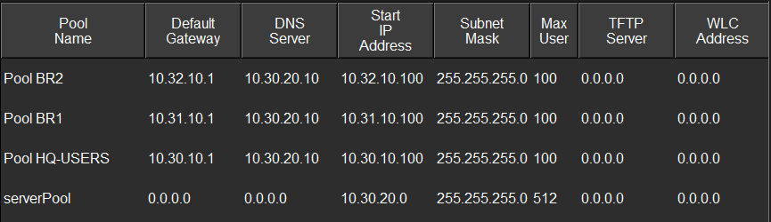

# DHCP

## Purpose

This folder documents the centralized DHCP service used to automatically configure client devices.

Instead of manually assigning an IPv4 address, subnet mask, default gateway, and DNS information to every workstation, the project uses DHCP to provide these settings automatically.

The internal server at headquarters provides DHCP service for multiple enterprise networks.

---

## DHCP Server Configuration

<p align="center">
  
</p>

<p align="center">
  <em>DHCP pools configured on the internal headquarters server.</em>
</p>

The centralized server provides address information for:

- HQ users;
- Branch 1 users;
- Branch 2 users.

The management network uses static addressing.

---

## Address Pools

The client ranges follow the project addressing plan:

| Network | Client Range |
|---|---|
| HQ Users | `10.30.10.100 - 10.30.10.199` |
| Branch 1 | `10.31.10.100 - 10.31.10.199` |
| Branch 2 | `10.32.10.100 - 10.32.10.199` |

The internal server also provides the correct default gateway and DNS information for each pool.

---

## DHCP Relay

Because the DHCP server is located at headquarters, clients on remote routed networks cannot reach it using a normal Layer 2 broadcast.

The routers therefore relay DHCP requests toward the server using:

```text
ip helper-address 10.30.20.10
```

Conceptually:

```text
Branch Client
     |
DHCP Broadcast
     |
Branch Router
     |
DHCP Relay
     |
Routed Enterprise Network
     |
SRV-INTERNAL
```

This makes it possible to use one centralized DHCP server for several different IP networks.

---

## What This Demonstrates

This section of the project demonstrates:

- centralized client addressing;
- DHCP pool design;
- gateway distribution;
- DNS distribution;
- DHCP relay across routed networks;
- integration between branch networks and headquarters services.
