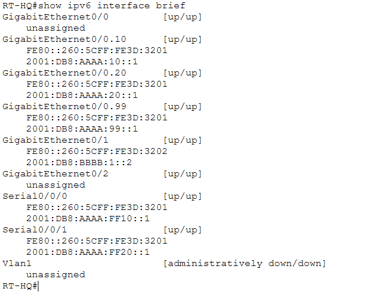
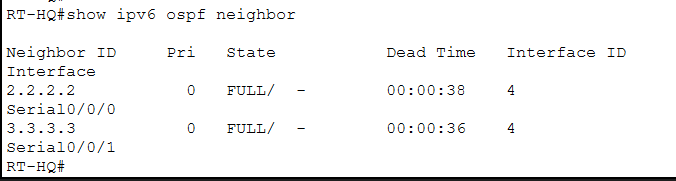
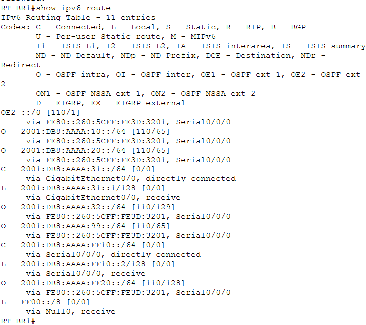

# IPv6

## Purpose

This folder documents the IPv6 extension of the enterprise topology.

IPv6 was implemented alongside the main IPv4 network to demonstrate dual-stack addressing and dynamic IPv6 routing between headquarters and the branch offices.

---

## RT-HQ IPv6 Interfaces

<p align="center">
  
</p>

<p align="center">
  <em>IPv6 addressing configured on the headquarters router.</em>
</p>

The headquarters router contains IPv6 addressing for internal VLANs, WAN links, and the ISP-facing segment.

---

## OSPFv3 Neighbors

<p align="center">
  
</p>

<p align="center">
  <em>OSPFv3 neighbor relationships established between headquarters and the branch routers.</em>
</p>

OSPFv3 is used to dynamically exchange IPv6 routes between the enterprise routers.

The router IDs used in the lab are:

```text
RT-HQ  → 1.1.1.1
RT-BR1 → 2.2.2.2
RT-BR2 → 3.3.3.3
```

---

## Branch 1 IPv6 Routes

<p align="center">
  
</p>

<p align="center">
  <em>IPv6 routes learned dynamically by RT-BR1.</em>
</p>

This evidence shows that Branch 1 is not limited to its directly connected IPv6 networks. It learns remote enterprise prefixes through OSPFv3.

---

## Addressing Structure

The internal topology uses prefixes from:

```text
2001:db8:aaaa::/48
```

while the simulated external side uses:

```text
2001:db8:bbbb::/48
```

Examples include:

```text
HQ Users      → 2001:db8:aaaa:10::/64
HQ Servers    → 2001:db8:aaaa:20::/64
HQ Management → 2001:db8:aaaa:99::/64
Branch 1      → 2001:db8:aaaa:31::/64
Branch 2      → 2001:db8:aaaa:32::/64
```

---

## What This Demonstrates

This part of the project demonstrates:

- IPv6 address planning;
- IPv6 interface configuration;
- dual-stack networking;
- OSPFv3;
- dynamic IPv6 route learning;
- IPv6 route verification.
