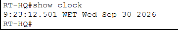
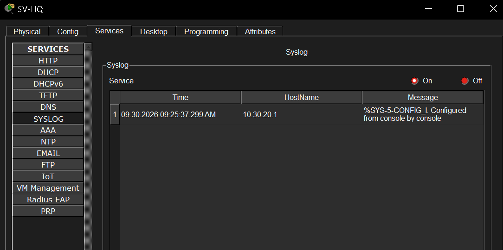
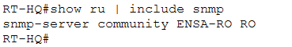

# Network Management

## Purpose

This folder documents the management and monitoring services configured in the lab.

A network must provide more than connectivity. Administrators also need visibility into device state, synchronized timestamps, centralized event logs, and methods for retrieving operational information.

The project uses NTP, Syslog, and SNMP to demonstrate these functions.

---

## NTP

<p align="center">
  
</p>

<p align="center">
  <em>NTP status and time-synchronization verification.</em>
</p>

NTP helps keep device clocks synchronized.

This is especially useful when analyzing logs because events from multiple devices are easier to correlate when timestamps are consistent.

---

## Syslog

<p align="center">
  
</p>

<p align="center">
  <em>Centralized Syslog messages received by the server.</em>
</p>

Syslog allows routers and switches to send event messages to a centralized location.

This provides better operational visibility than relying only on local console messages.

A typical destination configuration is:

```text
logging host 10.30.20.10
```

---

## SNMP

<p align="center">
  
</p>

<p align="center">
  <em>SNMP configuration used to expose monitoring information from network devices.</em>
</p>

SNMP provides a standardized way to retrieve management information from devices.

In this Packet Tracer lab, a read-only configuration is used for basic monitoring and MIB-based queries.

---

## Packet Tracer Limitations

Packet Tracer does not implement every IOS management feature exactly as a real Cisco device would.

Depending on the simulated device and Packet Tracer version:

- some logging commands may not exist;
- some SNMP OIDs may not be available;
- some NTP behavior may be simplified.

The screenshots in this folder therefore focus on the management functions that could be successfully validated in the simulator.

---

## What This Demonstrates

For someone without a networking background:

```text
NTP    → keeps clocks synchronized
Syslog → collects network event messages
SNMP   → retrieves monitoring information
```

For a technical reviewer, this section demonstrates the operational side of network administration in addition to basic routing and switching.
