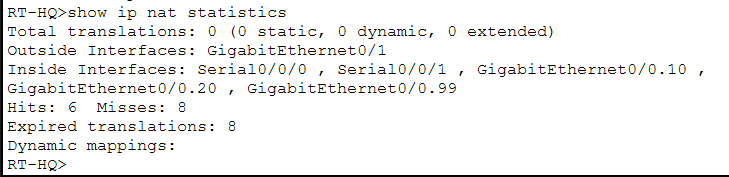
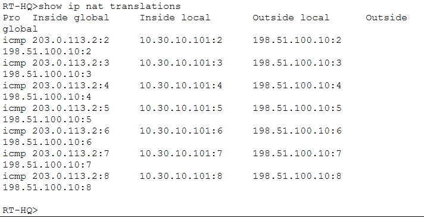
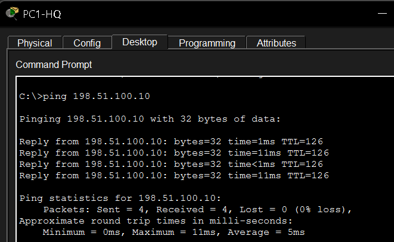

# NAT and PAT

## Purpose

This folder documents the Network Address Translation configuration used at the headquarters edge.

The enterprise network uses private IPv4 ranges internally. NAT/PAT allows internal devices to communicate through the ISP-facing side of the headquarters router using translated addressing.

---

## NAT Statistics

<p align="center">
  
</p>

<p align="center">
  <em>NAT statistics showing the configured inside and outside interfaces.</em>
</p>

This output is useful for confirming that the router understands which side of the topology is considered internal and which side faces the simulated external network.

---

## NAT Translation Table

<p align="center">
  
</p>

<p align="center">
  <em>Active address translations created by RT-HQ.</em>
</p>

The translation table provides direct evidence that internal traffic is being processed by NAT/PAT.

This is more reliable than using connectivity alone as proof of translation.

---

## Connectivity to the Simulated Public Server

<p align="center">
  
</p>

<p align="center">
  <em>Connectivity test toward the simulated public server.</em>
</p>

The public server used in the lab is:

```text
198.51.100.10
```

---

## Internal Networks Included in NAT

The project includes the enterprise networks:

```text
10.30.0.0/16
10.31.10.0/24
10.32.10.0/24
```

PAT allows multiple internal devices to share the ISP-facing address of the headquarters router.

Conceptually:

```text
HQ / BR1 / BR2 private addresses
              |
              v
           RT-HQ
              |
        NAT / PAT
              |
              v
     Simulated ISP network
```

---

## Verification Commands

Useful commands include:

```text
show ip nat translations
show ip nat statistics
```

During troubleshooting, translations can also be cleared in the lab with:

```text
clear ip nat translation *
```

---

## Important Simulation Note

Because the public server exists inside the Packet Tracer topology rather than on the real Internet, a ping alone should not be treated as the only evidence that NAT is functioning.

The translation table and NAT statistics shown above provide stronger evidence that translation is actually occurring.

---

## What This Demonstrates

This section demonstrates:

- NAT inside/outside concepts;
- PAT / NAT overload;
- private-to-external address translation;
- NAT verification;
- edge-connectivity testing.
