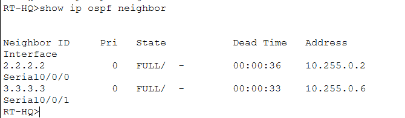
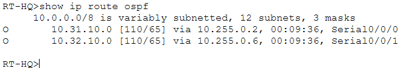
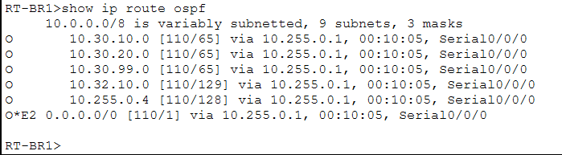
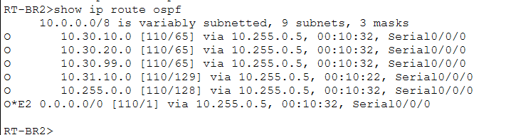

# Routing

## Purpose

This folder documents the dynamic IPv4 routing used to connect headquarters, Branch 1, and Branch 2.

The internal enterprise routers use OSPFv2 so that remote networks can be learned dynamically rather than requiring a separate static route for every destination.

---

## OSPF Neighbors on RT-HQ

<p align="center">
  
</p>

<p align="center">
  <em>OSPF adjacency between the headquarters router and both branch routers.</em>
</p>

A `FULL` neighbor state confirms that the routers have successfully formed an OSPF adjacency.

Router IDs used in the project:

```text
RT-HQ  → 1.1.1.1
RT-BR1 → 2.2.2.2
RT-BR2 → 3.3.3.3
```

---

## Routes on RT-HQ

<p align="center">
  
</p>

<p align="center">
  <em>Routes available on the headquarters router.</em>
</p>

The headquarters learns the branch LANs through OSPF while also maintaining its directly connected internal networks and the route toward the ISP.

---

## Routes on RT-BR1

<p align="center">
  
</p>

<p align="center">
  <em>Remote enterprise routes learned by Branch 1.</em>
</p>

Branch 1 learns how to reach headquarters and Branch 2 through OSPF.

---

## Routes on RT-BR2

<p align="center">
  
</p>

<p align="center">
  <em>Remote enterprise routes learned by Branch 2.</em>
</p>

Branch 2 similarly learns remote networks dynamically through the headquarters.

---

## OSPF Design

The project uses:

```text
OSPF process 10
Area 0
```

LAN-facing interfaces are advertised but do not need to form OSPF relationships with end devices.

The WAN serial links are the interfaces responsible for establishing router-to-router OSPF adjacencies.

---

## Default Route

`RT-HQ` uses a static default route toward the simulated ISP:

```text
ip route 0.0.0.0 0.0.0.0 203.0.113.1
```

This route can be advertised to the branches through OSPF.

On the branch routers, the learned default route may appear as:

```text
O*E2 0.0.0.0/0
```

---

## Verification Commands

Useful commands include:

```text
show ip ospf neighbor
show ip route
show ip route ospf
show ip protocols
```

---

## Relationship with Troubleshooting

OSPF is also used in deliberate failure scenarios involving:

- an OSPF area mismatch;
- an incorrect passive interface.

These scenarios are documented in:

```text
../troubleshooting/
```

---

## What This Demonstrates

This section demonstrates:

- OSPFv2;
- router IDs;
- Area 0;
- neighbor formation;
- dynamic route learning;
- passive interfaces;
- default-route propagation;
- routing-table analysis.
