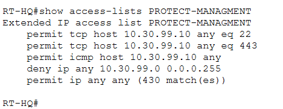
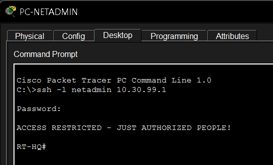
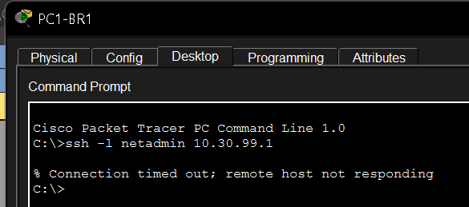

# Network Security

## Purpose

This folder documents the security mechanisms used to protect management access and control traffic toward the dedicated management network.

The project focuses on two main areas:

- traffic filtering with an extended ACL;
- secure remote administration using SSH.

---

## Management ACL

<p align="center">
  
</p>

<p align="center">
  <em>Extended ACL used to protect management-related traffic.</em>
</p>

> Note: the screenshot filename is intentionally referenced as `managment-acl.png` because that is the current filename in the repository.

The management network is:

```text
10.30.99.0/24
```

and the dedicated administration workstation is:

```text
PC-NETADMIN → 10.30.99.10
```

The ACL is designed to permit authorized management traffic while preventing unauthorized access to the management network.

---

## Authorized SSH Access

<p align="center">
  
</p>

<p align="center">
  <em>Successful SSH connection initiated from the authorized network-administration workstation.</em>
</p>

SSH provides encrypted remote command-line administration of routers and switches.

---

## Unauthorized SSH Test

<p align="center">
  
</p>

<p align="center">
  <em>SSH access test from a normal user device.</em>
</p>

This evidence is intended to show the difference between authorized management access and normal user access.

---

## ACL Logic

The management ACL follows this general logic:

```text
Allow authorized management traffic
        ↓
Block unauthorized traffic toward the management network
        ↓
Allow unrelated traffic
```

A representative rule set includes:

```text
permit tcp host 10.30.99.10 any eq 22
permit tcp host 10.30.99.10 any eq 443
permit icmp host 10.30.99.10 any
deny ip any 10.30.99.0 0.0.0.255
permit ip any any
```

The final explicit permit is important because Cisco ACLs always contain an implicit deny at the end.

---

## Verification Commands

Useful commands include:

```text
show access-lists
show ip ssh
show users
show running-config | section line vty
```

---

## Security Design Note

An interface ACL and VTY access control solve related but different problems.

An ACL applied to routed traffic protects network destinations, while VTY access restrictions specifically control who can initiate remote management sessions to a Cisco device.

This distinction is important when designing strict SSH-only management policies.

---

## What This Demonstrates

This section demonstrates:

- extended ACLs;
- management-network protection;
- ACL ordering;
- implicit deny behavior;
- SSH;
- authorized versus unauthorized management access;
- basic management-plane security.
