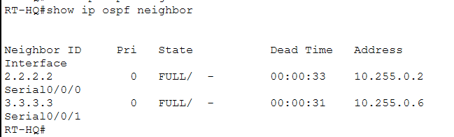
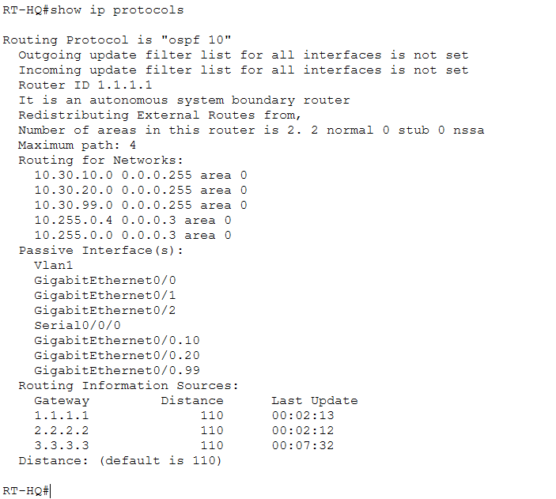
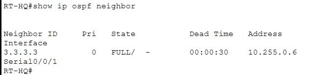
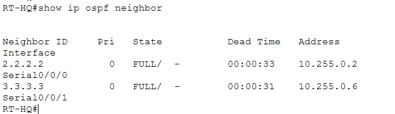
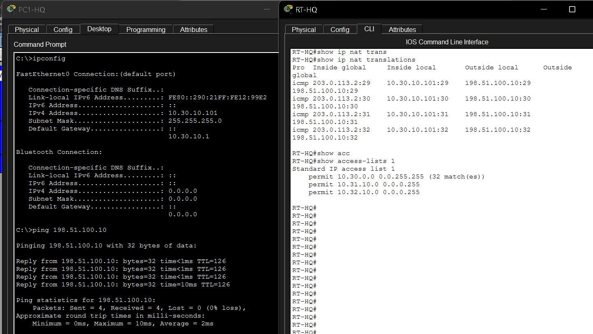
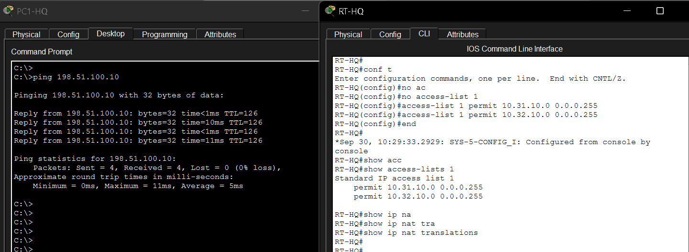
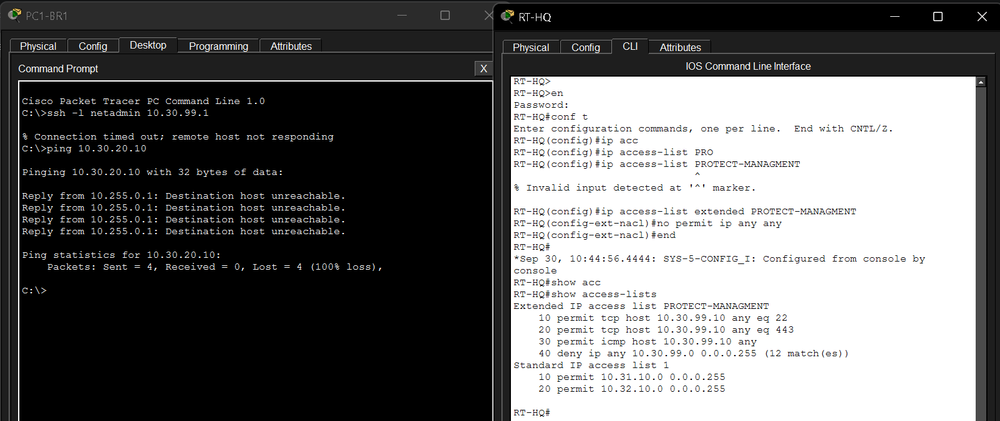
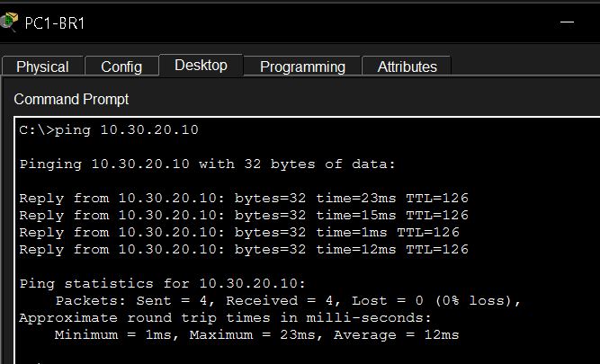

# Troubleshooting

## Purpose

This folder documents deliberate faults introduced into an otherwise functional network.

The goal is to demonstrate a structured troubleshooting process:

```text
Working network
      ↓
Controlled fault
      ↓
Observed symptom
      ↓
Diagnosis
      ↓
Correction
      ↓
Verification
```

Each incident is stored in its own subfolder.

---

# 1. OSPF Area Mismatch

Folder:

```text
01-ospf-area-mismatch/
```

## Before

<p align="center">
  
</p>

<p align="center">
  <em>Normal OSPF state before introducing the area mismatch.</em>
</p>

## Failure

<p align="center">
  
</p>

<p align="center">
  <em>OSPF adjacency failure after configuring incompatible OSPF areas on the same WAN link.</em>
</p>

## Diagnosis

<p align="center">
  
</p>

<p align="center">
  <em>Diagnostic output used to identify the incorrect OSPF area.</em>
</p>

## Fixed

<p align="center">
  
</p>

<p align="center">
  <em>OSPF adjacency restored after returning the link to the correct area.</em>
</p>

### Root Cause

OSPF routers connected to the same link must agree on the OSPF area. A mismatch prevents the neighbor relationship from reaching the normal `FULL` state.

---

# 2. Incorrect Passive Interface

Folder:

```text
02-passive-interface/
```

## Before

<p align="center">
  
</p>

<p align="center">
  <em>Normal OSPF adjacency before introducing the fault.</em>
</p>

## Failure

<p align="center">
  
</p>

<p align="center">
  <em>OSPF adjacency lost after the WAN interface was incorrectly made passive.</em>
</p>

## Fixed

<p align="center">
  
</p>

<p align="center">
  <em>Neighbor relationship restored after correcting the passive-interface configuration.</em>
</p>

### Root Cause

An OSPF passive interface does not send Hello packets. This is appropriate for LAN interfaces with end devices, but not for a WAN interface that must establish an OSPF adjacency with another router.

---

# 3. NAT Inside / Outside Fault

Folder:

```text
03-nat-inside-outside/
```

## Before

<p align="center">
  
</p>

<p align="center">
  <em>NAT state before the deliberate configuration change.</em>
</p>

## Failure

<p align="center">
  
</p>

<p align="center">
  <em>Evidence captured after introducing the NAT inside/outside fault.</em>
</p>

### Troubleshooting Focus

NAT depends on the router correctly identifying the internal and external sides of the network.

Useful verification commands include:

```text
show ip nat statistics
show ip nat translations
```

The NAT statistics output is particularly useful because it identifies which interfaces the router currently considers `inside` and `outside`.

### Packet Tracer Note

Because this project uses a fully simulated public network inside Packet Tracer, connectivity behavior may not always reproduce a real Internet edge failure exactly.

For that reason, NAT troubleshooting should consider translation tables and NAT statistics in addition to ping results.

---

# 4. ACL Implicit Deny

Folder:

```text
04-acl-implicit-deny/
```

## Failure

<p align="center">
  
</p>

<p align="center">
  <em>Traffic failure caused by reaching the ACL's implicit deny.</em>
</p>

## Fixed

<p align="center">
  
</p>

<p align="center">
  <em>Connectivity restored after correcting the ACL.</em>
</p>

### Root Cause

Every Cisco ACL contains an implicit deny at the end:

```text
deny ip any any
```

This statement is not normally shown as a manually configured rule.

If the intended final rule:

```text
permit ip any any
```

is removed, traffic that does not match an earlier permit statement is dropped.

---

## Troubleshooting Methodology

The scenarios in this folder follow a simple rule:

**change only one thing at a time.**

This makes it possible to associate the observed symptom with a specific configuration error.

Useful troubleshooting tools used throughout the project include:

```text
show ip interface brief
show ip ospf neighbor
show ip route
show ip protocols
show access-lists
show ip nat translations
show ip nat statistics
ping
```

---

## Final State

The deliberately broken configurations are only temporary.

After each scenario:

1. the fault is corrected;
2. normal operation is verified;
3. the final `project.pkt` is kept in a working state.

The screenshots preserve the troubleshooting process without leaving the main topology intentionally broken.
