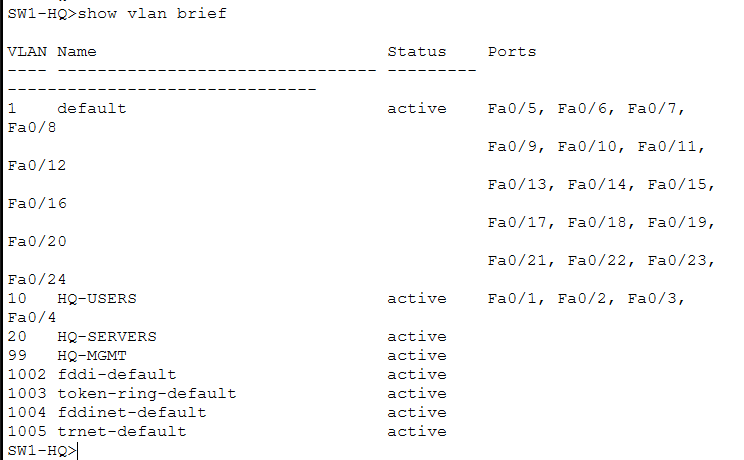
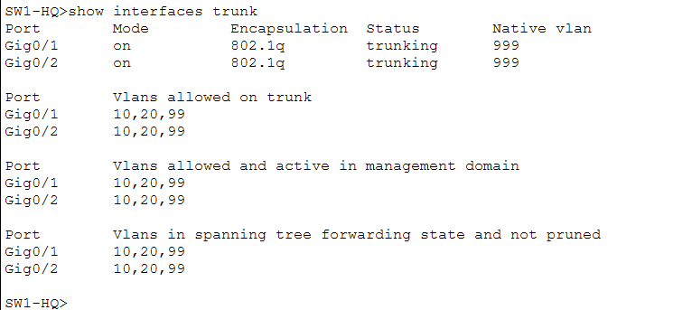
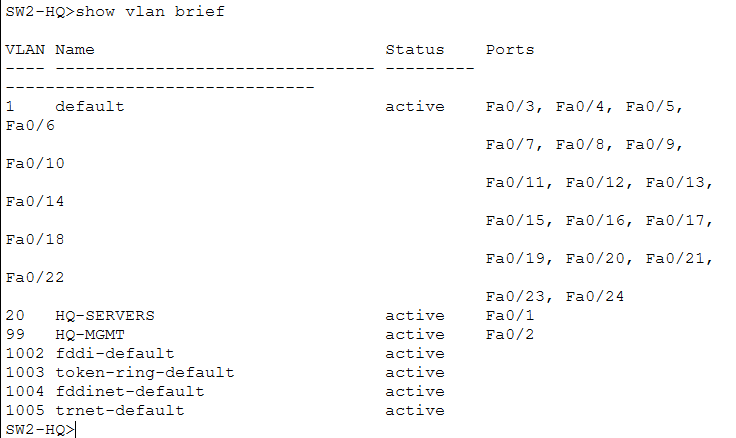
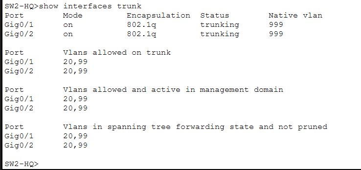

# VLANs and Trunking

## Purpose

This folder documents the Layer 2 segmentation used at headquarters.

Users, servers, and management devices are separated into different VLANs instead of sharing a single broadcast domain.

---

## VLANs on SW1-HQ

<p align="center">
  
</p>

<p align="center">
  <em>VLAN membership configured on the first headquarters switch.</em>
</p>

SW1-HQ provides connectivity for headquarters users and participates in the trunk links used to transport multiple VLANs.

---

## Trunks on SW1-HQ

<p align="center">
  
</p>

<p align="center">
  <em>802.1Q trunk status on SW1-HQ.</em>
</p>

Trunks allow multiple VLANs to share one physical Ethernet link while remaining logically separated.

---

## VLANs on SW2-HQ

<p align="center">
  
</p>

<p align="center">
  <em>VLAN membership configured on the second headquarters switch.</em>
</p>

SW2-HQ provides access for the server and management portions of the headquarters network.

---

## Trunks on SW2-HQ

<p align="center">
  
</p>

<p align="center">
  <em>802.1Q trunk status on SW2-HQ.</em>
</p>

---

## VLAN Design

The headquarters uses:

| VLAN | Purpose | Network |
|---|---|---|
| 10 | HQ Users | `10.30.10.0/24` |
| 20 | HQ Servers | `10.30.20.0/24` |
| 99 | HQ Management | `10.30.99.0/24` |

A separate native/dead VLAN is also used for trunking:

```text
VLAN 999
```

---

## Router-on-a-Stick

Inter-VLAN routing is performed by `RT-HQ` using subinterfaces.

Conceptually:

```text
RT-HQ G0/0
   |
   +-- G0/0.10 → VLAN 10 → 10.30.10.1
   +-- G0/0.20 → VLAN 20 → 10.30.20.1
   +-- G0/0.99 → VLAN 99 → 10.30.99.1
```

Each subinterface acts as the default gateway for the corresponding VLAN.

---

## Verification Commands

Useful commands include:

```text
show vlan brief
show interfaces trunk
```

The screenshots above provide evidence of both VLAN membership and trunk operation.

---

## What This Demonstrates

This section demonstrates:

- VLAN creation;
- access-port assignment;
- network segmentation;
- IEEE 802.1Q trunking;
- allowed VLANs;
- native VLAN concepts;
- router-on-a-stick;
- inter-VLAN routing.
